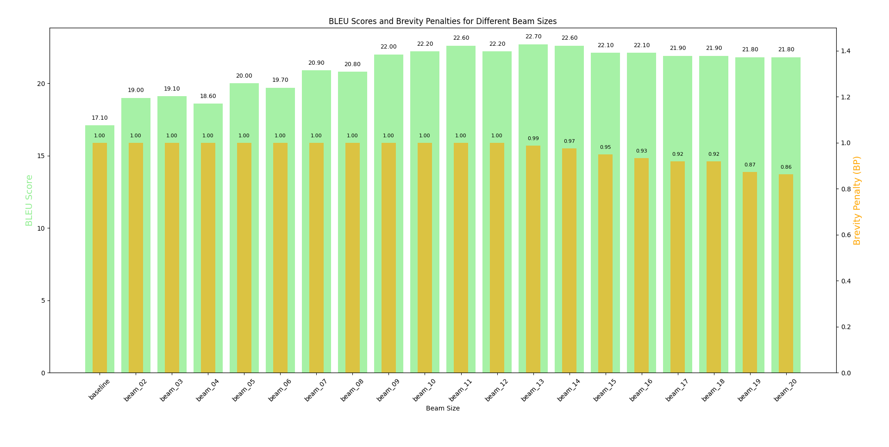

# ATMT Exercise 5

Jana Hofmann & Dominic Fischer

Github Repo: https://github.com/Fisherman-s-Friend/atmt_2024/tree/main/assignments/05

## 1. Experimenting with Beam Search

In terms of BLEU scores, we see the trend that we would have expected: a bigger beam size leads to better translations, but only up to a certain point. After that, we start to overly favour high-probability sequences, diminishing variability in the translation (this is bad, natural language is not deterministic, we need a certain variability). The best BLEU score of 22.7 is achieved with a beam size of 13, afterwards, performance drops slightly and seems to remain slightly below a BLEU score of 22. It is to be noted that if we increase the beam size by one and notice a drop in performance, we should not stop immediately. Rather, do the same thing for the next or maybe even the next two beam sizes. If these then also show a lower performance, we know that we have surpassed the zenith and therefore know which is the best beam size.

Interestingly, the brevity penalty drops (= the translations get shorter) as the beam size increases. We explain this as follows: the more we increase the beam size, the more emphasis we put on high probability. Tokens probabilities are chained together and, because they are mostly less than one, the longer a sequence, the less probable. Therefore, shorter sequences are favoured. Furthermore, language tends to favour short tokens for reasons of economy, thus short tokens are more probable and will also be favoured by the model.

As far as the decoding time is concerned, it increased approximately linearly with the beam size.

## 2. Understanding the Code

cf. "translate_beam.py".

## 3. Exploring Stopping Criteria in Beam Search

### 3.1 Understanding the current stopping condition

The "add_final" function in "beam.py" (row 24) is responsible for putting a finished sequence on to the queue of final hypotheses, after having padded it to make sure all hypotheses have the same length. It is called in row 193 in "translate_beam.py" if the last index is the EOS-token, which means that that hypothesis is done.

The beam size is reduced as "translate_beam.py" (row 216) calls "prune" in "beam.py" (row 57). There, we reassign our nodes-to-be-expanded-stack, putting only the top #beam_size-finished nodes onto the stack. In terms of why this should make sense, I would explain it as follows:

- we start from the k most probable translations and pursue them
- Once one of these is done, we know that we have found one of the k most probable translations, so we just need to look for the remaining k-1.

### 3.2 Implementing a Constant Beam Size Stopping Criterion

For this, we alter the "prune" function in "beam.py". Instead of changing the effective beam size by truncating the queue of unfinished nodes at #beam_size-finished (old "prune" function), we keep said queue at a max of length beam_size and only remove nodes from the queue if they reach the maximum length.

Prune function with Constant Beam size : https://github.com/Fisherman-s-Friend/atmt_2024/blob/5b537d6eb3579be7c1e143c537a91e97f3dde7e0/seq2seq/beam.py#L80-L81
Old prune function: https://github.com/Fisherman-s-Friend/atmt_2024/blob/5b537d6eb3579be7c1e143c537a91e97f3dde7e0/seq2seq/beam.py#L91-L92

The BLEU score (19.1) and its split was exactly the same, meaning also all the chosen translations were the same. The times, however, were very different. The original method took only 21 seconds, while the modified method took 6 minutes and 22 seconds. Based on this experiment, keeping the beam size does not make sense at all. We end up with a bunch of overly long and therefore unlikely translations, and the one that would be chosen with a changing beam is chosen anyways.

### 3.3 Implementing a Stopping Criterion with Pruning

We altered the prune function in "beam.py" such that it checks for finished sentences and extracts the probability score of the best one as "best_final_score". If no sentences have been finished yet, we set the score to infinity to still have a value to compare to.
If the probability of the current node is worse than the "best_final_score", we discard the node (and all following ones, as they are going to be worse). Otherwise, we keep beam_size nodes in the queue. https://github.com/Fisherman-s-Friend/atmt_2024/blob/0a93c6f51ff0355047f86d6b5fb1dd6634d801f6/seq2seq/beam.py#L60

In regard to the other methods, the BLEU score (19.1) was exactly the same for all three of them, meaning also all the chosen translations were the same (We also checked the actual translation and could not find any difference.)
The time improved slightly on my computer (19 seconds for original, and 16 seconds for stopping criterion with pruning). In our experiment, the stopping criterion with pruning was the best one. It is a good trade-off between speed and quality,
as it is faster than the original method and still produces the same results.

If we assume that all incomplete hypotheses are strictly worse than the best finished hypothesis (e.g., probabilities of later completions cannot recover), then pruning is optimal.
If this is not the case, the method might discard a hypothesis that would have been able to produce an overall better probability down the line than the best one found so far. However, in practice, this would mean that the model would have to explore a lot of unlikely hypotheses, which would be computationally more expensive.

### Comparision of the three stopping criteria

Three different approaches were presented to us:

A dynamically adapting beam size stopping criterion,
A constant beam size with a maximum length stopping criterion, and
A constant beam size with a stopping criterion involving pruning.
In our experiment, the pruning stopping criterion performed the best. It provides a good trade-off between speed and quality, as it is faster than the original method while still producing the same results. However, there are advantages and disadvantages to each of the methods, and the best approach might be a combination of them.

Pruning is efficient, focusing on high-scoring hypotheses, but it may lose diversity. This method works best in scenarios where the model is confident in its predictions and the best hypotheses are likely to be found early.
The dynamically adapting beam size stopping criterion maintains more diversity and can recover from intermediate steps where the current best hypothesis might be suboptimal. However, it is slower than the pruning method.
The constant beam size with a maximum length stopping criterion is inefficient but preserves the most diversity. It may be useful in cases where for example word order differs significantly between the source and target languages, or we translate very domain specifically.
